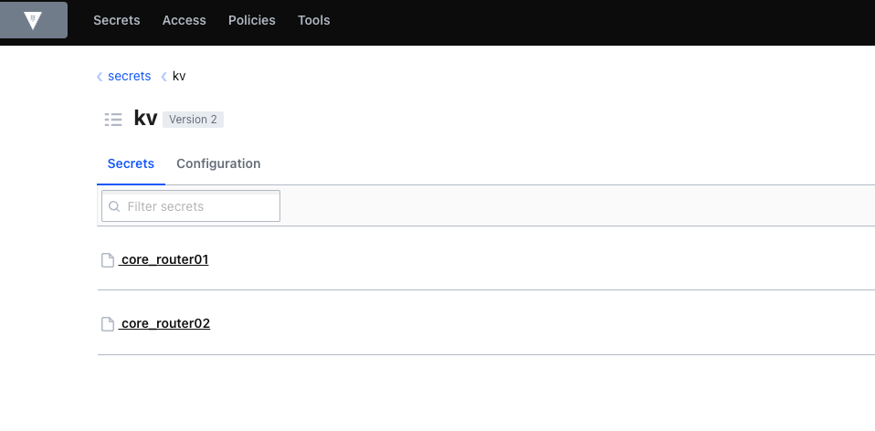

# Cisco using Ansible and HashiCorp Vault

This is an example repo showing Ansible connecting to HashiCorp Vault to retrieve a username, password, and SNMP information stored in a simple K/V store.

The retrieve username and password is used to update SNMP on a Cisco router.

## Vault Config

For simplicity we are passing the Vault server and token using environment variables:
```
export VAULT_SERVER=''
export VAULT_TOKEN=''
```

Vault is configured with a simple KV store. The information is stored in Vault under a secret matching the `inventory_hostname`:



Each secret contains the following information:


## Ansible inventory

A simple Ansible inventory has been provided in `inventory/hosts.yml`.

## Consuming

A `requirements.txt` and `Pipfile` file has been included with all the dependancies.

The following dependanices are required for a manual install:
```
python==3.11.0
ansible==7.1.0
paramiko==2.12.0  # Needed by Ansible Cisco IOS
hvac==1.0.2  # Needed by Ansible's HashiCorp Vault Lookup Plugin
```

## Playbook Execution

Core router 1 state before:


Playbook Execution:


Core router 1 state after:


