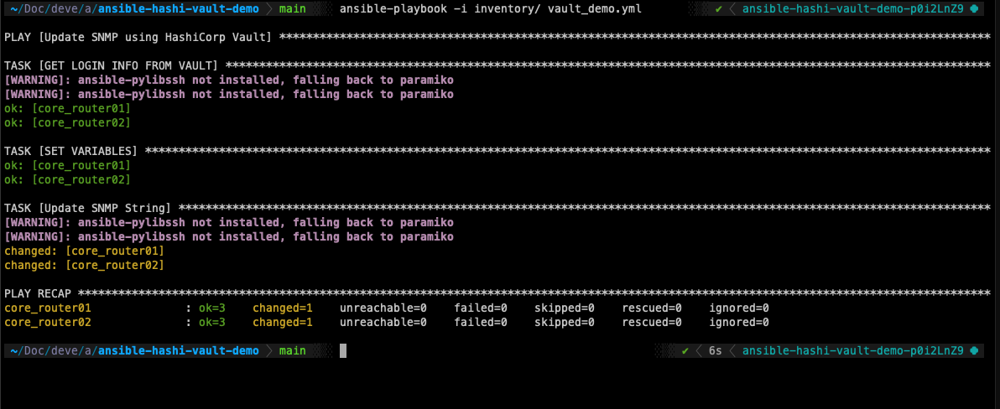

# Ansible and HashiCorp Vault

This is an example repo showing Ansible connecting to HashiCorp Vault to retrieve a username, password, and SNMP information stored in a simple K/V store.

The retrieve username and password is used to update SNMP on the device.


## Vault Config

For simplicity we are passing the Vault server and token using environment variables:
```
export VAULT_SERVER=''
export VAULT_TOKEN=''
```

Vault is configured with a simple KV store. The information is stored in Vault under a secret matching the `inventory_hostname`:


## Playbook Execution

Router state before:


Playbook Execution:




Router state after:


